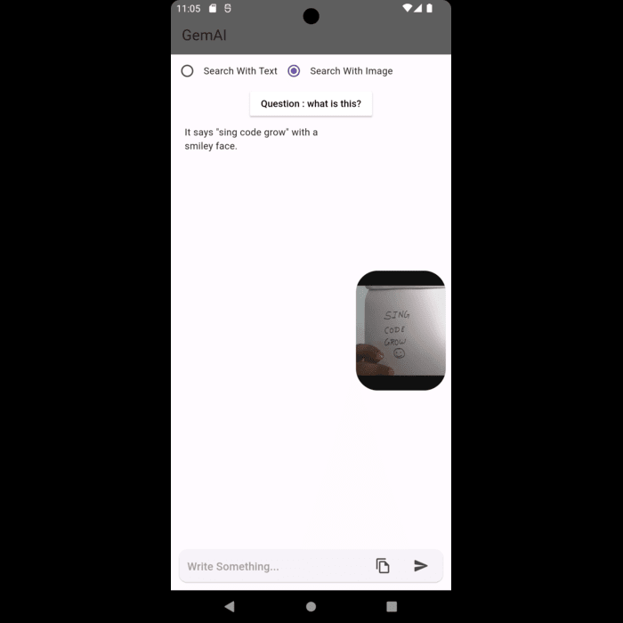

# GemAI-ChatBot Using Gemini API

This Flutter app integrates with the Gemini API for image recognition. Users can upload images, and the app will use Gemini to identify and describe the contents of the images.

## Features

- **Image Recognition**: Upload images and receive descriptions of identified objects.
- **Flutter & Dart**: Developed using Flutter framework and Dart programming language.
- **Gemini API**: Utilized for image analysis and object recognition.
- **Responsive UI**: User-friendly interface designed for mobile devices.

## Technologies Used

- **Flutter & Dart**: Framework and language used for frontend development.
- **Gemini API**: API for image recognition and analysis.
- **HTTP Requests**: Used to communicate with the Gemini API.
- **Material Design**: UI components follow Google's Material Design guidelines.

## Screenshots

<p align="center">
  
</p>

## Getting Started

Follow these steps to run the app locally:

### Prerequisites

- Install Flutter: [Flutter Installation Guide](https://flutter.dev/docs/get-started/install)
- Set up an emulator or connect a physical device.

### Installation

1. Clone the repository:

   ```bash
   git clone https://github.com/Ritiky23/GemAI.git
